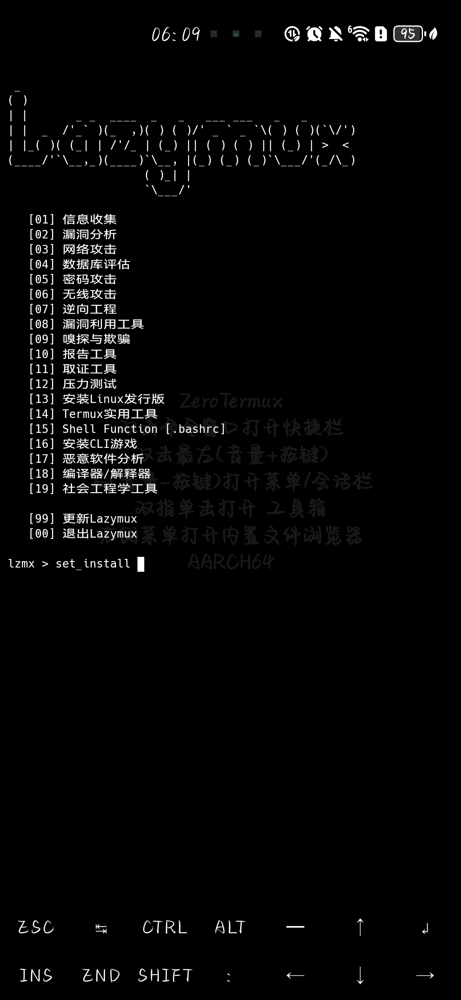

[](https://github.com/Gameye98/Lazymux/stargazers)
[](https://github.com/Gameye98/Lazymux/network/members)
[](https://github.com/Gameye98/Lazymux/issues)
[](https://github.com/Gameye98/Lazymux/watchers)
[](https://www.python.org)
[](https://www.gnu.org/software/bash/)
[](http://www.wtfpl.net/)
[](https://github.com/BlackHoleSecurity)
[](https://github.com/Gameye98)

[](https://github.com/Gameye98)  

[](https://github.com/BlackHoleSecurity)

# Lazymux
Lazymux 是一款帮助你在安卓系统上轻松安装和使用多款渗透测试与黑客工具的工具。它支持用户快速安装和使用Nmap、SQLMap、Metasploit等多种主流工具(内包含开户工具)，只需通过命令即可完成工具的安装与调用。Lazymux 是开源项目，对渗透测试和道德黑客任务非常有帮助。

用心制作 ❤️

## 功能
- **工具安装**  
安装单个工具  
`lzmx > set_install 1`  
安装多个工具  
`lzmx > set_install 1 2 3 4`  
安装所有工具  
`lzmx > set_install @`  
- **默认目录安装**
在 `lazymux.conf` 中 将符号 ~ 替换为你需要的目录  
示例: lazymux.conf  
`HOME = /sdcard`


## 截图


### 依赖
• Python 3.x
• termux或zeortermux

#### 安装与使用方法
```bash
pkg install python git
git clone https://github.com/wzxczh/termux-Lazymux
cd termux-Lazymux
python lazymux.py
```
